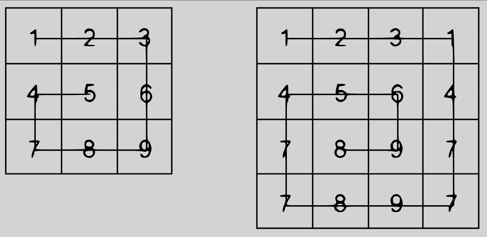

# 🐌 Snail Sort


## 📘 Description

Écrire une fonction qui **parcourt une matrice carrée (n × n) en suivant un motif en spirale dans le sens des aiguilles d'une montre**.

Ce parcours est appelé **Snail Sort** (parcours en escargot).

La fonction doit retourner **un tableau contenant les éléments de la matrice dans l'ordre de parcours**.

🔗 **Kata Codewars** - [Snail](https://www.codewars.com/kata/521c2db8ddc89b9b7a0000c1)

<p align="center">• • •</p>

## ⚙️ Règles

La fonction doit respecter les règles suivantes :

- Recevoir **une matrice carrée (n × n)** d'entiers
- Parcourir les éléments **de l'extérieur vers le centre**
- Le parcours se fait **dans le sens horaire (clockwise)**
- Retourner **un tableau contenant les éléments dans l'ordre du parcours**

⚠️ Il ne s'agit **pas de trier les éléments**, mais uniquement de **les parcourir selon un motif en spirale**.

<p align="center">• • •</p>

## 💡 Principe

Le parcours en spirale consiste à :

1. parcourir la **première ligne de gauche à droite**
2. parcourir la **dernière colonne de haut en bas**
3. parcourir la **dernière ligne de droite à gauche**
4. parcourir la **première colonne de bas en haut**

Puis répéter ce processus **en réduisant les limites de la matrice** jusqu'au centre.

Conceptuellement :

```

haut → droite → bas → gauche

```

Puis on continue **vers l'intérieur de la matrice**.



<p align="center">• • •</p>

## 🔎 Exemples

### Exemple 1

Matrice :

```

[[1,2,3],
[4,5,6],
[7,8,9]]

```

Résultat :

```

[1,2,3,6,9,8,7,4,5]

```

### Exemple 2

Matrice :

```

[[1,2,3],
[8,9,4],
[7,6,5]]

```

Résultat :

```

[1,2,3,4,5,6,7,8,9]

```

<p align="center">• • •</p>

## ⚠️ Cas particulier

Une **matrice vide** est représentée par :

```

[[]]

```

Dans ce cas, le résultat attendu est :

```

[]

```

<p align="center">• • •</p>

## 🧪 Tests

Les tests unitaires associés sont disponibles dans le projet :

- 📁 [Projet de tests NUnit](../../../tests/4kyu/Snail.Tests/)

Les tests couvrent notamment :

- des **matrices 3×3**
- des **matrices de tailles différentes**
- le **parcours correct en spirale**
- le **cas d'une matrice vide**

<p align="center">• • •</p>

## 🧾 Résumé

La fonction doit :

- recevoir **une matrice carrée (n × n)**
- parcourir les éléments **en spirale dans le sens horaire**
- retourner **un tableau contenant les éléments dans cet ordre**

Exemple :

```

[[1,2,3],
[4,5,6],
[7,8,9]]

```

Résultat :

```

[1,2,3,6,9,8,7,4,5]

```
