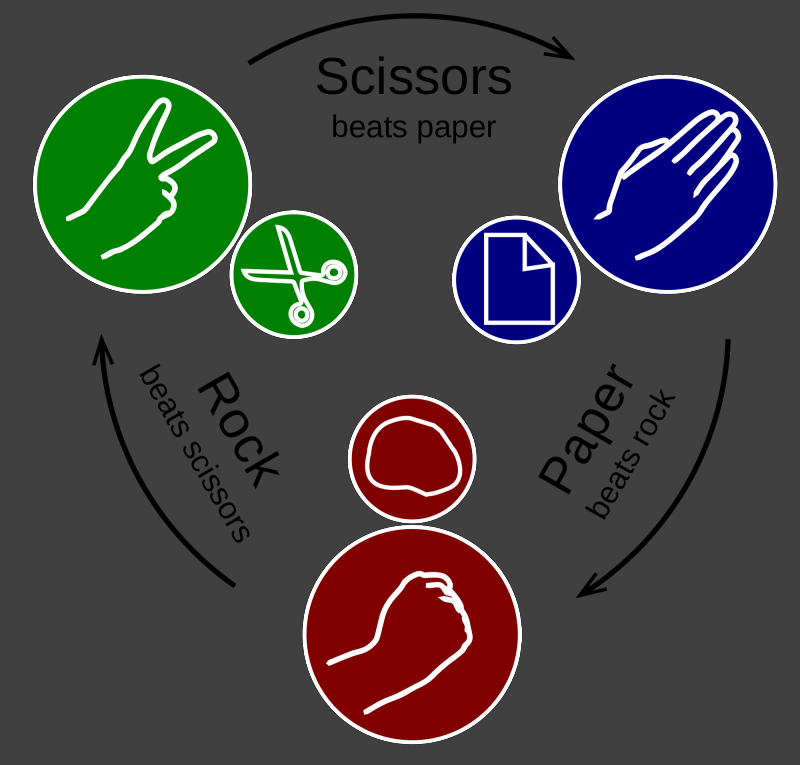

# ✊ Rock Paper Scissors


## 📘 Description

Implémenter la logique du célèbre jeu **Rock, Paper, Scissors** (Pierre, Feuille, Ciseaux).

Deux joueurs choisissent chacun un mouvement parmi :

- `"rock"`
- `"paper"`
- `"scissors"`

La fonction doit **déterminer quel joueur gagne** selon les règles du jeu.

🔗 **Kata Codewars** - [Rock Paper Scissors](https://www.codewars.com/kata/5672a98bdbdd995fad00000f)

<p align="center">• • •</p>

## ⚙️ Règles du jeu

Les règles sont les suivantes :

- **Rock** bat **Scissors**
- **Scissors** battent **Paper**
- **Paper** bat **Rock**
- Si les deux joueurs choisissent **le même mouvement**, la partie est **nulle**

La fonction doit retourner :

- `"Player 1 won!"` → si le joueur 1 gagne
- `"Player 2 won!"` → si le joueur 2 gagne
- `"Draw!"` → si les deux joueurs ont choisi le même mouvement

<p align="center">• • •</p>

## 💡 Principe

La logique consiste à :

1. Vérifier si les deux choix sont **identiques**
2. Sinon comparer les combinaisons possibles

Conceptuellement :

```

si p1 == p2 → Draw
sinon vérifier les règles du jeu

```

Exemples de conditions :

```

rock bat scissors
scissors bat paper
paper bat rock

```

<p align="center">• • •</p>

## 🔎 Exemples

| Joueur 1 | Joueur 2 | Résultat |
|----------|----------|----------|
| `"scissors"` | `"paper"` | `"Player 1 won!"` |
| `"scissors"` | `"rock"` | `"Player 2 won!"` |
| `"paper"` | `"paper"` | `"Draw!"` |
| `"rock"` | `"scissors"` | `"Player 1 won!"` |

<p align="center">• • •</p>

## 🧪 Tests

Les tests unitaires associés sont disponibles dans le projet :

- 📁 [Projet de tests NUnit](../../../tests/8kyu/RockPaperScissors.Tests/)

Les tests couvrent notamment :

- les **trois cas de victoire possibles**
- les **situations de match nul**
- différentes **combinaisons de mouvements**
- plusieurs **tests automatiques**

<p align="center">• • •</p>

## 🧾 Résumé

La fonction doit :

- recevoir **le choix de deux joueurs**
- appliquer **les règles du jeu Rock / Paper / Scissors**
- retourner :

```

"Player 1 won!" → si le joueur 1 gagne
"Player 2 won!" → si le joueur 2 gagne
"Draw!"         → si les deux joueurs font le même choix

```




